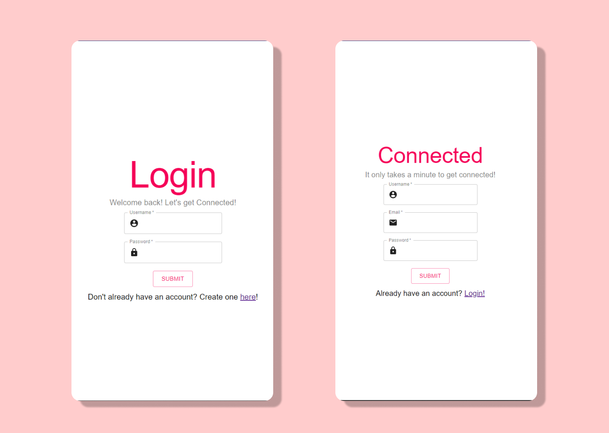

# Connected-A-Social-Network
A social networking app that allows you to connect with friends and family across the globe.

## Overview 
Connected is a social networking app that allows the user to view their profile, update their profile information and view a feed that shares posts from friends and family.

## 1. Research 
Before jumping into designing, I first brainstormed applications that were already widely used and accessed by different communities. Applications like Facebook, Instagram, Twitter, Snapchat, Linkedin, and others were known for being successful in creating fostering relationships despite distance, language barriers, etc. They all shared factors that made them easy to gravitate towards: 

- Clean imagery
- Clear copy
- Ease of access 

When brainstorming how to execute my own application, I wanted to keep these factors in mind. 

## 2. Design Process 
I created user profiles to align with design considerations I had for making a inclusive-focused app.

***How might someone who is completely new to the app interact with the different components?***
- Dana is 26 years old and has recently decided that she would like to create a social media account to meet new people especially artists to share and critique her work. She is familiar with popular social media apps but does not have an account.

***How might someone who requires accessibility features interact with the different components?***
- Ricardo is 35 years old and uses a screen reader to interact with social media. He is familiar with the basic upload components found in most apps. He is seeking an app that allows him to connect with friends and family on a day to day basis through writing and photos.

***How might someone who is a social media guru interact with different components?***
- Amira is an 18 yo socialite who loves using social media to connect with her fans from other platforms.She likes to take stylistic pphotos of hersel. She also assists sponsors with ad content and strategy to boost sales and commissions.

## 3. Must-Haves 
Requirements for this project include: 
- [x] Use a modern JS Library/Framework
    - In this project, I used ReactJS.

- [ ] Allows user to interact with application in a minimum of 3 different ways *In progress*
    - As a user, you can sign up for a new account, login into your account, and I am currently working on rendering the profile details so that you can edit your profile with your information to replace default placeholders.

- [x] Uses architectural pattern
    -For this project, I applied the Model-View-Controller architectural pattern to organize my code. The model folder holds the interfaces and database schemas for users info and password. The views is the client folder with the src files for components being rendered, and the controller folder holds the api logic.

- [ ] Integration with a 3rd party RESTful API *In progress*
    - Outside of integrating with a 3rd party API, I also wrote some of my own backend api routes to CREATE a new user with default profile settings, LOGIN user and once authenticated REDIRECT them to the profile page on the frontend.

- [x] Uses at least 5 UI components from material-ui/@core 
    - I utilized multiple UI components from the material-ui npm package. For styling I applied basic Typography for the font and Grid for layout. I also pulled the email, password, and account icon. I also incorporated the Button component throughout the front end.

- [ ] Uses a reusable UI  component that I created *In progress*

## 4. Views 


## 5. Folder Structure Explained
- Client/View
The client folder hosts the react-app. Boilerplate data is housed in the folder alongside the components/pages that are rendered client-side from the src folder.


- Models
The models folder contains the database schema that is used as the blueprint for finding and mapping information between collections hosted on MongoDB. A subfolder in models called interfaces holds the typing for what type of information is expected to go into parameters outlined in the profile and user schema. The profile schema holds default values that the user will be able to change upon intializing an update request to the server.


- Controllers 
The controllers folder holds the userController.ts file which houses the api logic that is called in the api-routes.ts file in the routes folder. This file tells the server what to do when it receives a request. 


- Additional Files 
Additional files and folders of importannce: 
    - Routes 
        - The Routes folder holds the html router that tells the server what page to host. The api router tells the server what request to call and with what criteria. If I had more time I would have additionally debugged the api Router alongside its companion controller file in order to stop the code from caling the get profile twice and allow it to render client side so that that user can update their profile.
        

    - Config
        - The config file holds the code that authenticates the user through passport js local-strategy and checks that they have an account saved to the database. If they do not they are not allowed access to view profile. Once the user is authenticated with the correct user name and password they are then redirected to the profile page.
        

## 6. How to Install + Live Demo
To run the code locally install dev dependences and run: 
```npm run dev```


## 5. Languages, Frameworks, and Libraries 
- [Typescript](https://www.typescriptlang.org/)
- [ReactJS](https://reactjs.org/docs/getting-started.html) 
- [PassportJS](http://www.passportjs.org/) 
- [ExpressJS](https://expressjs.com/)
- [Mongoose](https://mongoosejs.com/)
- [Axios](https://github.com/axios/axios) 